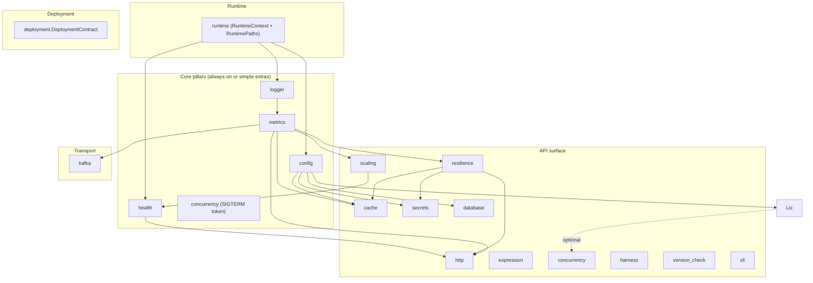

# Architecture

How the pieces fit. Read [README.md](README.md) for the value
proposition; this page is the module map and dependency graph.

---

## Layering

Three layers, top to bottom:

- **Core pillars** — config, logger, metrics, health, shutdown. Always
  available (no extras required for `config` / `logger`; `metrics` and
  `health` need their respective extras). Every other module depends on
  one or more of these.
- **Runtime** — environment detection (K8s / Docker / BareMetal) and
  container-aware paths. Used by core pillars to pick log format,
  metric defaults, probe wiring, and config file locations.
- **API surface** — composable modules apps wire as needed: HTTP,
  cache, secrets, expression, resilience, concurrency, harness,
  version-check, scaling, CLI, database. Each is independent of the
  others; pick what you need.

Sibling concerns:

- **Transport** — Kafka producer/consumer/admin (sync + async wrappers).
- **Deployment** — `DeploymentContract` Pydantic model and the
  Dockerfile / Helm / ArgoCD / Compose generators.

---

## Module dependency graph

Solid arrows: hard dependency (module on left used by module on right).
Dotted arrow: optional / conditional.

Three observations:

- Every module above the runtime layer depends on at least one core
  pillar. Apps that just want config + logs install nothing else and
  stop here.
- `resilience` is the only cross-cutting API-surface module: HTTP,
  cache, and secrets all wrap it (`with_resilience` decorator).
  Stamina + purgatory under the hood.
- `metrics` is the second cross-cutting one: anything that does I/O
  emits counters/histograms when metrics is installed.

---

## Source-of-truth module list

From `src/hyperi_pylib/`:

| Module | Type | Lines (incl. tests) | Public API entry |
|---|---|---|---|
| `cache/` | dir | ~1,200 | `configure_cache`, `@cached`, `PostgresCache` |
| `cli/` | dir | ~1,500 | `DfeApp`, standard options, common patterns |
| `concurrency.py` | file | 220 | `run_blocking`, `Bulkhead`, `gather_with_timeouts` |
| `config/` | dir | ~3,000 | `settings`, `get_environment`, `get_app_name`, `init_config_directory` |
| `data/` | dir (data only) | — | TOML/INI files for gitleaks rules + national-ID validators |
| `database/` | dir | ~400 | `build_database_url`, `parse_database_url` |
| `deployment/` | dir | ~4,500 | `DeploymentContract`, `generate_*`, `ContractIdentity`, `test_support` |
| `expression/` | dir | ~600 | `evaluate`, `evaluate_condition`, `validate`, `compile_expression` |
| `harness/` | dir | ~1,000 | `run`, `smart_run`, `smart_run_function`, `HarnessResult` |
| `health/` | dir | ~500 | `HealthManager`, `create_health_router`, probe handlers |
| `http/` | dir | ~800 | `HttpClient`, `AsyncHttpClient` |
| `kafka/` | dir | ~2,500 | `KafkaProducer`, `KafkaConsumer`, `AsyncKafka*`, `KafkaAdmin`, `SchemaAnalyser` |
| `logger/` | dir | ~4,000 | `logger`, convenience fns, `scrub/` package |
| `metrics/` | dir | ~3,500 | `create_metrics`, `dfe_groups/*`, `CardinalityTracker`, FastAPI middleware |
| `resilience/` | dir | ~300 | `CircuitBreaker`, `CircuitBreakerConfig` |
| `runtime/` | dir | ~600 | `get_runtime_paths`, `RuntimePaths`, `RuntimeEnvironment` |
| `scaling/` | dir | ~350 | `ScalingPressure`, `ScalingPressureConfig`, `PressureSnapshot` |
| `secrets/` | dir | ~2,500 | `SecretsManager`, providers (file/openbao/aws/gcp/azure/ansible-vault) |
| `version_check/` | dir | ~300 | `check_on_startup`, `VersionCheckConfig` |

Total source: ~30k LoC.

The `Application` framework was removed to backlog (see
`src/hyperi_pylib/__init__.py:101-107`) — use modules directly.

---

## What's not here vs hyperi-rustlib

Rustlib ships several modules pylib does not, by design:

- `transport/` abstraction layer (rustlib has Kafka, gRPC, HTTP, Redis,
  File, Pipe, Memory transports behind a single trait). Pylib has Kafka
  only; no abstraction layer planned.
- `pipeline/` — BatchEngine, WorkerPool, TieredSink, Spool, DLQ,
  STRmatch. None of these exist in pylib. Python's async model + GIL
  make the hot-path concurrency story different; we use
  `concurrency.gather_with_timeouts` for the simple cases.
- `tracing` as a distinct module. Pylib emits structured log fields
  but does not currently wire W3C `traceparent` propagation across
  modules. Tracking issue: when this lands, it'll get a
  `core-pillars/TRACING.md`.

What pylib has that rustlib doesn't:

- `harness/` — subprocess execution with smart hang detection. Useful
  for CI step orchestration and K8s readiness probe shell-outs.
- `expression/` CEL bindings via PyO3 to `cel-interpreter` Rust crate
  so Python and Rust services evaluate the same expressions
  byte-identically.

---

## Naming parity with rustlib

| Concept | rustlib | pylib |
|---|---|---|
| Runtime entry point | `ServiceRuntime` + `DfeApp` trait | `Application` (deprecated; compose modules directly) |
| Cache abstraction | `moka` TinyLFU | `cashews` (SQLite or PostgreSQL backend) |
| HTTP client | `reqwest` + retry | `httpx` + stamina retry |
| Circuit breaker | `purgatory` (vendored) | `purgatory` (PyPI) |
| Retry | `stamina` (Rust crate) | `stamina` (Python PyPI) |
| Config | `figment` 8-layer | `dynaconf` 8-layer |
| Logger | `tracing` | `loguru` |
| Metrics | `metrics` crate + `prometheus-exporter` | `prometheus-client` + `opentelemetry-*` |
| CLI | `clap` + `cli/app.rs` | `typer` + `cli/app.py` |
| Expression | `cel-interpreter` direct | `common-expression-language` (PyO3 wrapper around `cel-interpreter`) |

The doc subdirs match where the concept maps 1:1. Where pylib lacks
the concept (`transport/` abstraction, `pipeline/`), the subdir is
absent rather than carrying placeholder files.

---

## Related

- [README.md](README.md)
- [INTEGRATION.md](INTEGRATION.md)
- [AUTO-WIRING.md](AUTO-WIRING.md)
- [EXTRAS-FLAGS.md](EXTRAS-FLAGS.md)
- [runtime/RUNTIME-CONTEXT.md](runtime/RUNTIME-CONTEXT.md)
