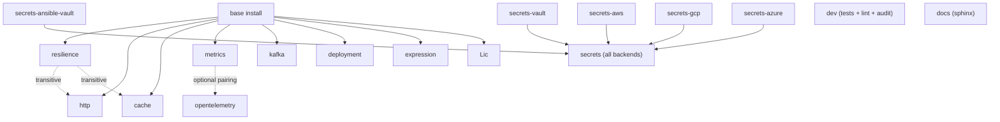

# Extras flags

Python equivalent of rustlib's `FEATURE-FLAGS.md`. Where rustlib uses
cargo features, pylib uses [PEP 631 extras](https://peps.python.org/pep-0631/).
Same idea: install what you need, pay nothing for what you don't.

This page covers:

- The base install (what ships with no extras)
- The extras tree (which extras pull in which deps)
- Native deps (apt packages on Linux that some extras assume)
- Recommended bundles for common app shapes

For the *what* — what an extra actually does — see the subsystem doc
linked in each row. This page is about which extras to enable and what
that costs.

---

## Base install

```toml
[project]
dependencies = ["hyperi-pylib>=2.28.3"]
```

That gives you:

- 8-layer config cascade (`from hyperi_pylib import config`)
- Structured logger with autodetect format + secret scrubbing (`from hyperi_pylib import logger`)
- Container-aware runtime paths (`from hyperi_pylib import runtime`)
- Health probe router primitives (`from hyperi_pylib import health`)
- DB URL builders (`from hyperi_pylib.database import build_database_url`)
- CLI framework (`from hyperi_pylib.cli import DfeApp`)
- Concurrency primitives (`from hyperi_pylib import concurrency`)
- Subprocess harness (`from hyperi_pylib import harness`)
- Version-check probe (`from hyperi_pylib.version_check import check_on_startup`)

Base runtime deps (transitive): dynaconf, loguru, python-dotenv, pyyaml,
mergedeep, tomli-w, typer, dulwich, anyio, asyncer, detect-secrets,
phonenumbers, python-stdnum, regex.

That's it for the no-extras path. If you only need those, stop here.

---

## Extras tree



Solid arrows: independent extra. Dotted arrows: extra automatically
pulled in by another (no need to list both). The `secrets` extra is a
meta-extra that installs every backend at once.

---

## Per-extra detail

### Core observability

| Extra | Adds | Native deps | Doc |
|---|---|---|---|
| `metrics` | `prometheus-client`, `psutil` | none | [core-pillars/METRICS.md](core-pillars/METRICS.md) |
| `opentelemetry` | `opentelemetry-api`, `opentelemetry-sdk`, `opentelemetry-exporter-otlp`, `opentelemetry-exporter-prometheus` | none | [core-pillars/METRICS.md](core-pillars/METRICS.md) |

Pair these for dual-export: OTel pushes via OTLP, exposes `/metrics`
via the prometheus exporter, all from one backend.

### Cross-cutting primitives

| Extra | Adds | Native deps | Doc |
|---|---|---|---|
| `resilience` | `stamina`, `purgatory` | none | [api/RESILIENCE.md](api/RESILIENCE.md) |
| `http` | `httpx`, `stamina`, `purgatory` | none | [api/HTTP-CLIENT.md](api/HTTP-CLIENT.md) |
| `cache` | `cashews`, `msgpack`, `psycopg[binary,pool]` | `libpq-dev` on Linux if not using `psycopg[binary]` (we use `[binary]` so it's bundled) | [api/CACHE.md](api/CACHE.md) |

`http`, `cache`, and every `secrets-*` extra pull `resilience` in
transitively. Install `resilience` directly only if you want
standalone circuit breakers without the rest.

### Transport + data

| Extra | Adds | Native deps | Doc |
|---|---|---|---|
| `kafka` | `confluent-kafka`, `genson` | `librdkafka` (bundled in confluent-kafka wheels) | [transport/KAFKA.md](transport/KAFKA.md) |
| `database` | (none — base utilities only) | per-DB driver if you use one (psycopg/pymongo/redis-py) | [api/DATABASE.md](api/DATABASE.md) |

### Deployment + identity

| Extra | Adds | Native deps | Doc |
|---|---|---|---|
| `deployment` | `pydantic>=2.13` | none | [deployment/CONTRACT.md](deployment/CONTRACT.md) |

`ContractIdentity` and the parity/test-support helpers ship with the
`deployment` extra. The fixture under `tests/fixtures/contract-parity/`
is part of the test suite, not a runtime artefact.

### Expression evaluation

| Extra | Adds | Native deps | Doc |
|---|---|---|---|
| `expression` | `common-expression-language` (PyO3 wrapper around `cel-interpreter` Rust crate) | none (precompiled wheels) | [api/EXPRESSION.md](api/EXPRESSION.md) |

Provides byte-identical CEL evaluation with rustlib's `expression`
crate. Same expression, same result, regardless of which language the
service is in.

### Secrets

| Extra | Adds | Native deps | Doc |
|---|---|---|---|
| `secrets-vault` | (none extra — uses base HTTP client) | none | [api/SECRETS.md](api/SECRETS.md) |
| `secrets-aws` | `boto3`, `aiobotocore` | none | [api/SECRETS.md](api/SECRETS.md) |
| `secrets-gcp` | `google-cloud-secret-manager` | none | [api/SECRETS.md](api/SECRETS.md) |
| `secrets-azure` | `azure-keyvault-secrets`, `azure-identity` | none | [api/SECRETS.md](api/SECRETS.md) |
| `secrets-ansible-vault` | `ansible-vault` | none | [api/SECRETS.md](api/SECRETS.md) |
| `secrets` | all of the above | none | [api/SECRETS.md](api/SECRETS.md) |

Pick the backend(s) you actually use. The meta-extra `secrets` is
convenient but pulls ~50 MB of cloud SDKs.

### Version check

| Extra | Adds | Native deps | Doc |
|---|---|---|---|
| `version-check` | (none -- uses httpx if available, falls back gracefully) | none | [api/VERSION-CHECK.md](api/VERSION-CHECK.md) |

### Marker extras

These extras intentionally pull no extra dependencies. They exist so
downstream `pyproject.toml` files can document INTENT (this service
uses the CLI framework / will get the future "enhanced" bundle)
without committing to a transitive deps tree that may change.

| Extra | Notes | Doc |
|---|---|---|
| `cli` | Base install already ships `typer` + `DfeApp`. Listing `hyperi-pylib[cli]` declares CLI dependence without adding deps. | [api/CLI.md](api/CLI.md) |
| `enhanced` | Reserved. Will bundle a curated "DFE service" feature set once the shape is locked. Currently a no-op marker. | (no doc yet) |

### Development

| Extra | Adds | Doc |
|---|---|---|
| `dev` | pytest + asyncio + cov + httpx + ruff + mypy + ty + bandit + pip-audit + vulture + moto + faker + pre-commit | (install for contributing to pylib) |
| `docs` | sphinx + rtd-theme + myst-parser | (install for building docs) |

---

## Recommended bundles

### Tooling CLI / one-shot script

```toml
dependencies = ["hyperi-pylib>=2.28.3"]
```

Base install only. Config + logger + runtime + CLI framework.

### FastAPI service (config + logs + metrics)

```toml
dependencies = ["hyperi-pylib[metrics,opentelemetry]>=2.28.3"]
```

### Kafka consumer (typical DFE shape)

```toml
dependencies = [
    "hyperi-pylib[kafka,metrics,opentelemetry,resilience,http,deployment]>=2.28.3",
]
```

### DFE service with Vault secrets

```toml
dependencies = [
    "hyperi-pylib[kafka,metrics,opentelemetry,secrets-vault,resilience,http,deployment]>=2.28.3",
]
```

### Multi-cloud service (Vault primary, AWS fallback)

```toml
dependencies = [
    "hyperi-pylib[kafka,metrics,opentelemetry,secrets-vault,secrets-aws,resilience,http,deployment]>=2.28.3",
]
```

### Everything (CI test runner, integration suites)

```toml
dependencies = [
    "hyperi-pylib[kafka,metrics,opentelemetry,cache,http,secrets,deployment,expression,resilience,dev]>=2.28.3",
]
```

---

## Native deps cheat-sheet

For Linux container images, the `NativeDepsContract` (see
[deployment/NATIVE-DEPS.md](deployment/NATIVE-DEPS.md)) automatically
emits the right apt-install block for the extras the contract
references. The mapping:

| Extra | Apt packages |
|---|---|
| `kafka` | none (confluent-kafka wheels bundle librdkafka) |
| `cache` (psycopg `[binary]`) | none |
| `cache` (psycopg without `[binary]`) | `libpq5` |
| `metrics` | none |
| `secrets-aws` / `secrets-gcp` / `secrets-azure` | `ca-certificates` (already in base image) |
| `expression` | none (CEL wheel bundles the Rust binary) |

In short: pylib's wheels are largely self-contained. The
`NativeDepsContract` exists to support edge cases where you opt out of
binary wheels.

---

## Notes on pinning

- Pylib pins minimum versions, not maximum, except where a breaking
  change in a transitive dep is known.
- Bump to >= the major version that ships the feature you need;
  trailing pins (`<3` etc.) are deliberate.
- `>=2.28.3` is the floor for [Contract Identity v1](deployment/IDENTITY.md);
  earlier versions don't have `ContractIdentity`.

---

## Related

- [README.md](README.md)
- [ARCHITECTURE.md](ARCHITECTURE.md)
- [INTEGRATION.md](INTEGRATION.md)
- [AUTO-WIRING.md](AUTO-WIRING.md)
- [deployment/NATIVE-DEPS.md](deployment/NATIVE-DEPS.md)
