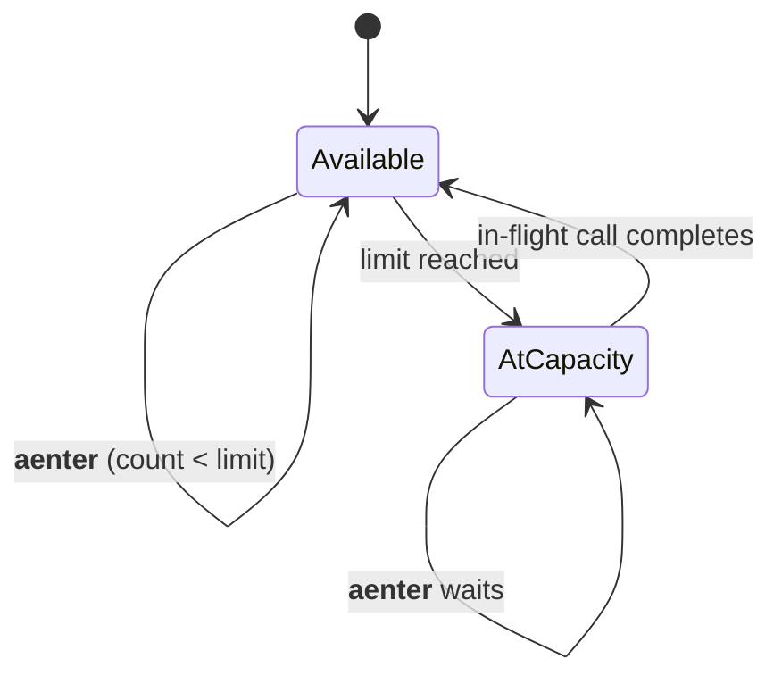

# Concurrency

Four async primitives every HyperI capability composes — built on
AnyIO and asyncer so they work under asyncio (and trio, if you ever
need it). Ships in the base package — no extras to install.

```python
from hyperi_pylib.concurrency import (
    run_blocking, make_async, Bulkhead, gather_with_timeouts,
)
```

Composable resilience (timeout + retry + circuit breaker + bulkhead) is
in [`RESILIENCE.md`](RESILIENCE.md) — this module is the building blocks.

---

## Quick start

```python
from hyperi_pylib.concurrency import run_blocking, Bulkhead

aws_bulkhead = Bulkhead("aws-secrets", limit=32)

async def get_secret(path: str) -> bytes:
    async with aws_bulkhead:
        return await run_blocking(boto3_client.get_secret_value, SecretId=path)
```

---

## Discipline (the reason this module exists)

- Never call `loop.run_in_executor` directly. Use `run_blocking`.
- Never write `async def foo_async(...): return self.foo_sync(...)` —
  that blocks the event loop. Use `make_async` or the dual-API pattern
  below.
- Never share one global `ThreadPoolExecutor` across many downstreams.
  Use one `Bulkhead` per dependency — that's what "bulkhead" means.

---

## `run_blocking` — sync-to-async bridge

```python
import anyio
from hyperi_pylib.concurrency import run_blocking

async def read_config(path: Path) -> bytes:
    return await run_blocking(path.read_bytes)

# With a per-call concurrency limit
limiter = anyio.CapacityLimiter(8)
data = await run_blocking(expensive_sync_call, limiter=limiter)
```

Built on `anyio.to_thread.run_sync` for portable cancellation across
asyncio and trio. AnyIO's global limiter (40 threads) caps total thread
usage. Pass a per-dependency limiter or a `Bulkhead` for finer control.

| Arg | Default | What it does |
|-----|---------|--------------|
| `abandon_on_cancel` | `False` | If `False`, the task waits for the thread even when cancelled. Python cannot interrupt a running thread, so the wait keeps result handling deterministic. |
| `limiter` | AnyIO default (40) | `anyio.CapacityLimiter` to bound this specific call. |

---

## `make_async` — dual-API pattern

When wrapping a sync library, implement `X_sync()` once and bind
`X_async = make_async(X_sync)` at class level:

```python
from hyperi_pylib.concurrency import make_async

class FileProvider:
    def get_sync(self, path: str) -> bytes:
        return Path(path).read_bytes()

    get_async = make_async(get_sync)
```

`make_async` is `asyncer.asyncify` — type checkers see the wrapped
signature, IDE completion just works, and the async version always
offloads to a worker thread. The bad pattern — `async def foo(): return
self.foo_sync()` — silently blocks the loop; the audit script in
`tests/` catches it.

---

## `Bulkhead` — bounded concurrency per dependency

Pattern: one `Bulkhead` instance per `(service, endpoint)` pair. When
the in-flight count hits `limit`, the next async caller waits.

```python
from hyperi_pylib.concurrency import Bulkhead

vault_bulkhead = Bulkhead("vault-read", limit=16)
db_bulkhead    = Bulkhead("postgres", limit=8)

async def fetch_with_isolation(path: str):
    async with vault_bulkhead:
        return await vault_client.read(path)
```

A slow Vault doesn't starve every other coroutine that needs Postgres —
each downstream has its own queue.



Built on `anyio.Semaphore`. `limit` must be `>= 1`.

---

## `gather_with_timeouts` — parallel exec with per-task timeout

Each task gets its own `asyncio.timeout(per_task_timeout)`. Exceptions
(including `TimeoutError`) are captured per-task — one slow check
doesn't fail the others.

```python
from hyperi_pylib.concurrency import gather_with_timeouts

results = await gather_with_timeouts(
    {
        "db":    lambda: db.ping(),
        "kafka": lambda: producer.health_check(),
        "redis": lambda: redis.ping(),
    },
    per_task_timeout=1.0,
)

healthy = {k: v for k, v in results.items() if not isinstance(v, Exception)}
```

Note that values in the input dict are **coroutine factories**, not
coroutines — passing a coroutine directly couples its lifetime to the
gather call and prevents clean cancellation. The lambda wrapper keeps
each task independent.

Return shape: `dict[str, T | Exception]`. Inspect with `isinstance(v,
Exception)` to separate success from failure.

---

## When to reach for which primitive

| You have | Reach for |
|----------|-----------|
| A sync function you must call from async code | `run_blocking` |
| A sync class you want to expose async methods on | `make_async` (one bind per method) |
| A downstream service that occasionally goes slow | `Bulkhead` around the call |
| A bunch of independent async health checks | `gather_with_timeouts` |
| Retry + timeout + circuit breaker + bulkhead | `with_resilience()` in [`RESILIENCE.md`](RESILIENCE.md) |
| Parallel CPU-bound work | Not this module — use `ProcessPoolExecutor` or move to Rust |

---

## Anti-patterns

```python
# Don't
async def get_async(self, k):
    return self.get_sync(k)  # blocks the loop

# Do
get_async = make_async(get_sync)

# Don't
shared_pool = ThreadPoolExecutor(max_workers=32)
async def call_a():
    return await loop.run_in_executor(shared_pool, slow_a)
async def call_b():
    return await loop.run_in_executor(shared_pool, slow_b)
# Slow A starves B

# Do
bulkhead_a = Bulkhead("service-a", limit=16)
bulkhead_b = Bulkhead("service-b", limit=16)
async def call_a():
    async with bulkhead_a:
        return await run_blocking(slow_a)
```

---

## Related

- [RESILIENCE.md](RESILIENCE.md)
- [HTTP-CLIENT.md](HTTP-CLIENT.md)
- [SECRETS.md](SECRETS.md)
- [CACHE.md](CACHE.md)
- [../core-pillars/HEALTH.md](../core-pillars/HEALTH.md)
- [../INTEGRATION.md](../INTEGRATION.md)
