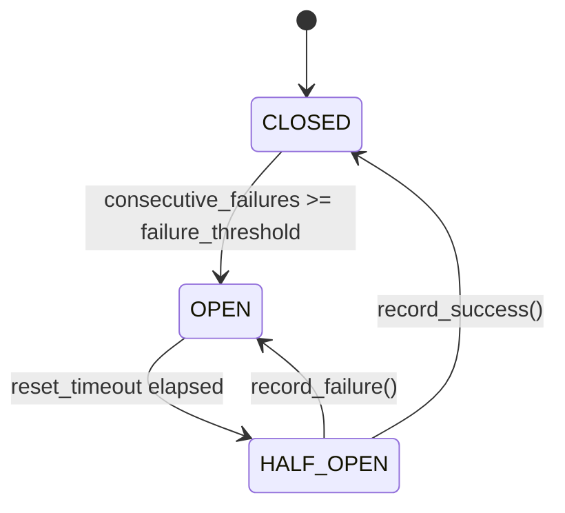

# Resilience

Circuit breaker matching `hyperi-rustlib`'s
`src/resilience/circuit_breaker.rs` byte for byte. Same three-state
machine (CLOSED / OPEN / HALF_OPEN), same thresholds, same semantics —
a service rewritten from Python to Rust trips and recovers identically.
Ships in the base package.

```python
from hyperi_pylib.resilience import (
    CircuitBreaker, CircuitBreakerConfig, CircuitBreakerError, CircuitState,
)
```

---

## Quick start

```python
cb = CircuitBreaker("payments", CircuitBreakerConfig(failure_threshold=3))

with cb:
    response = call_downstream()  # raises CircuitBreakerError if OPEN
```

---

## State machine



| State | Behaviour |
|-------|-----------|
| `CLOSED` | All calls permitted. Successes reset the failure counter, failures increment it. Hitting `failure_threshold` consecutive failures opens the circuit. |
| `OPEN` | All calls rejected with `CircuitBreakerError`. After `reset_timeout` seconds elapses, the breaker auto-transitions to `HALF_OPEN` on the next state check. |
| `HALF_OPEN` | A small number of probe calls (`half_open_max_calls`, default 1) are permitted. A success closes the breaker; a failure reopens it. Subsequent calls during the probe window are rejected. |

The OPEN → HALF_OPEN transition is **lazy** — it happens the next time
the state is read, not at the `reset_timeout` instant. Reading
`cb.state` or calling `cb.is_call_permitted()` triggers the check.

---

## Configuration

```python
from hyperi_pylib.resilience import CircuitBreakerConfig

cfg = CircuitBreakerConfig(
    failure_threshold=5,    # consecutive failures before opening
    reset_timeout=30.0,     # seconds to wait in OPEN before probing
    half_open_max_calls=1,  # number of probe calls in HALF_OPEN
)
```

Defaults match Rust: `failure_threshold=5`, `reset_timeout=30.0`,
`half_open_max_calls=1`.

---

## Sync usage

```python
from hyperi_pylib.resilience import CircuitBreaker, CircuitBreakerError

cb = CircuitBreaker("payments")

try:
    with cb:
        response = payment_gateway.charge(amount)
except CircuitBreakerError:
    # OPEN or HALF_OPEN-max-reached — short-circuit the caller
    return {"status": "queued_for_later"}
```

The context manager records a success on clean exit and a failure on
any exception — the exception always propagates (`__exit__` never
returns truthy).

---

## Async usage

```python
cb = CircuitBreaker("kafka-broker-1")

async with cb:
    await producer.send(topic, key, value)
```

The async path delegates to the sync `__enter__` / `__exit__` —
acquiring the internal lock is fast (no I/O), and matching Rust's
behaviour matters more than slightly faster lock contention. Safe for
concurrent use from many tasks or threads via `threading.Lock`.

---

## Manual record / probe

```python
if cb.is_call_permitted():
    try:
        do_thing()
        cb.record_success()
    except Exception:
        cb.record_failure()
        raise
```

Use the explicit `record_success` / `record_failure` API when you can't
wrap the call in a `with` block — for example, when you're already
inside someone else's retry harness.

```python
cb.reset()  # force CLOSED, clear counters (operational override)
```

---

## Inspect state

```python
state = cb.state           # CircuitState.CLOSED | OPEN | HALF_OPEN
permitted = cb.is_call_permitted()
name = cb.name             # the instance label
```

`cb.state` triggers the OPEN → HALF_OPEN auto-transition if the reset
timeout has elapsed — useful for emitting "would this call go through?"
metrics without actually attempting the call.

---

## Composition with HTTP and bulkheads

A breaker around a downstream call layered with a `Bulkhead`:

```python
from hyperi_pylib.concurrency import Bulkhead
from hyperi_pylib.resilience import CircuitBreaker
from hyperi_pylib.http import AsyncHttpClient

cb = CircuitBreaker("payments")
bulkhead = Bulkhead("payments", limit=16)
http = AsyncHttpClient(base_url="https://payments.example.com")

async def charge(amount: int):
    async with bulkhead:
        async with cb:
            return await http.post("/charge", json={"amount": amount})
```

Layer order: bulkhead **outside** the breaker. Otherwise a tripped
breaker rejects calls instantly without holding a bulkhead slot, but a
slow downstream that doesn't trip the breaker can still saturate the
bulkhead — that's by design, the bulkhead exists for exactly that case.

---

## Naming convention

One `CircuitBreaker` per `(downstream service, endpoint)` pair. Name
follows the dotted path of what's being protected:

```python
payments_cb = CircuitBreaker("payments.charge")
inventory_cb = CircuitBreaker("inventory.reserve")
vault_cb = CircuitBreaker("vault.read")
```

The name appears in `CircuitBreakerError` messages and is the natural
label for any future observability hooks.

---

## Cross-language parity

The Python breaker mirrors `hyperi-rustlib`'s implementation exactly:

| Behaviour | Both |
|-----------|------|
| State enum values | `closed`, `open`, `half_open` (lowercase string) |
| Default threshold | 5 consecutive failures |
| Default reset timeout | 30.0 seconds |
| HALF_OPEN entry trigger | Lazy on state read |
| HALF_OPEN max probe calls | 1 |
| `reset()` semantics | Force CLOSED, clear all counters |
| Thread safety | Lock-guarded mutations |

A breaker tripped in a Python service and one tripped in a Rust service
look identical in metrics and behave identically on recovery.

---

## Errors

`CircuitBreakerError` is raised on entry when:

- The circuit is `OPEN`, or
- The circuit is `HALF_OPEN` and `half_open_max_calls` probes are
  already in flight.

The error message includes the breaker name. It is a plain
`Exception` subclass — catch with `try/except CircuitBreakerError`.

---

## Related

- [CONCURRENCY.md](CONCURRENCY.md)
- [HTTP-CLIENT.md](HTTP-CLIENT.md)
- [SECRETS.md](SECRETS.md)
- [SCALING.md](SCALING.md)
- [../core-pillars/METRICS.md](../core-pillars/METRICS.md)
- [../INTEGRATION.md](../INTEGRATION.md)
