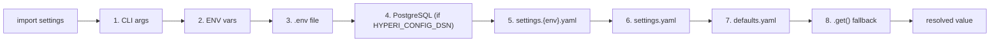

# Config

Eight-layer configuration cascade backed by Dynaconf. Import `settings`,
read it like a dict, and every value resolves through CLI args, env
vars, `.env`, optional PostgreSQL config source, per-environment YAML,
base YAML, defaults YAML, and hard-coded fallbacks -- in that order.
Every pylib-based service shares this cascade so the same `LOG_LEVEL`,
`MYAPP_DATABASE_HOST`, or `settings.production.yaml` key behaves
identically across daemons, CLIs, and Kafka consumers.

---

## The cascade

| # | Layer | Source | When it wins |
|---|-------|--------|--------------|
| 1 | CLI args | `--host prod.db.com` (Typer/Click) | One-shot runtime override |
| 2 | Env vars | `MYAPP_DATABASE_HOST=...` | Deployment-injected |
| 3 | `.env` file | `./.env` (or `~/.env` + `./.env` with `HYPERI_DOTENV_CASCADE=true`) | Local dev secrets, gitignored |
| 4 | PostgreSQL | `config_values` table (opt-in via `HYPERI_CONFIG_DSN`) | Shared org config |
| 5 | `settings.{env}.yaml` | Per-environment overlay (e.g. `settings.production.yaml`) | Environment-specific |
| 6 | `settings.yaml` | Project base | Team defaults |
| 7 | `defaults.yaml` | Safe fallback | Local dev |
| 8 | Hard-coded | `settings.get("k", "default")` | Last resort |

Layer 4 (PostgreSQL) is optional, off by default, and OVERRIDES file
layers when enabled -- only CLI, env, and `.env` win above it. See
[api/DATABASE.md](../api/DATABASE.md#postgresql-config-source) for
schema, fallback file caching, and operator runbook.

---

## Read it like a dict

```python
from hyperi_pylib.config import settings

# Attribute access, dot-separated keys.
brokers = settings.kafka.brokers
batch_size = settings.processor.batch_size

# Dict-style with fallback (recommended for optional keys).
host = settings.get("database.host", "localhost")
timeout = settings.get("api.timeout", 30)
```

Env keys are auto-generated from the dotted path:

| Config path | Env key (prefix `MYAPP`) |
|-------------|--------------------------|
| `database.host` | `MYAPP_DATABASE_HOST` |
| `cache.redis.enabled` | `MYAPP_CACHE_REDIS_ENABLED` |
| `kafka.brokers` | `MYAPP_KAFKA_BROKERS` |

Prefix comes from `HYPERI_LIB_ENV_PREFIX` (default `APP`).

---

## Multi-file discovery

For each YAML layer (`defaults`, `settings`, `settings.{env}`), pylib
searches four locations and merges every file found, later overriding
earlier:

1. `./` -- current directory
2. `./config/` -- project config subdir
3. `/config/` -- container ConfigMap mount
4. `~/.config/{app_name}/` -- XDG user config

Both `.yaml` and `.yml` extensions are checked (`.yaml` wins on tie).
App name resolves from `APP_NAME` env, then `HYPERI_LIB_APP_NAME`,
then auto-detect, then `"app"`. App environment resolves from
`APP_ENV`, `ENVIRONMENT`, `ENV`, then `"development"`.

---

## Env-var substitution in YAML

```yaml
database:
  host: ${POSTGRES_HOST:-localhost}
  port: ${POSTGRES_PORT:-5432}
  password: ${POSTGRES_PASSWORD}    # No default -- KeyError if unset

logging:
  level: ${LOG_LEVEL:-INFO}
```

Default-value syntax matches shell: `${VAR:-default}`. No default
means the var must be set or Dynaconf raises.

---

## Hot-reload

`ConfigReloader` polls Dynaconf at a configurable interval and
optionally re-reads on SIGHUP:

```python
from hyperi_pylib.config import ConfigReloader, ReloaderConfig

def on_reload(settings):
    logger.info("config reloaded", brokers=settings.kafka.brokers)

reloader = ConfigReloader(
    ReloaderConfig(poll_interval=30.0, enable_sighup=True),
    on_reload=on_reload,
    validate_fn=lambda s: s.kafka.brokers,    # reject empty brokers
)
await reloader.start()
# ... app runs ...
await reloader.stop()
```

`reload_count_success` and `reload_count_error` properties feed into
[AppMetrics.record_config_reload](METRICS.md#dfe-groups) for
observability. SIGHUP is a no-op on Windows and in restricted
environments.

---

## Cross-cutting envs

These bypass the cascade entirely and tweak pylib's own behaviour:

| Var | Effect | Default |
|-----|--------|---------|
| `HYPERI_LIB_APP_NAME` | Service name (used in paths, env prefix) | `app` |
| `HYPERI_LIB_ENV_PREFIX` | Env var prefix for cascade keys | `APP` |
| `HYPERI_LIB_DEBUG` | Verbose config-loading debug logs | unset |
| `HYPERI_CONFIG_DSN` | Enable PostgreSQL layer 4 | unset (disabled) |
| `HYPERI_CONFIG_FALLBACK_ENABLED` | Cache PG config to local file | `false` |
| `HYPERI_DOTENV_CASCADE` | Load `~/.env` then `./.env` | `false` |
| `CONTAINER_BASE_PATH` | Override container mount root | unset |
| `LOG_LEVEL` | Logger level (also a cascade key) | `INFO` |

---

## Container-aware paths

`get_mount_config()` returns a `MountConfig` dataclass with paths that
change shape per environment -- the same code reads `/config` in K8s,
`/app/config` in Docker, `~/.config/{app}` on bare metal.

```python
from hyperi_pylib.config import get_mount_config

mounts = get_mount_config()
config_file = mounts.config_dir / "app.yaml"
data_file = mounts.data_dir / "state.db"
```

| Mount | K8s | Docker | Local |
|-------|-----|--------|-------|
| `config_dir` | `/config` | `/app/config` | `~/.config/{app}` |
| `secrets_dir` | `/secrets` | `/run/secrets` | `~/.{app}/secrets` |
| `data_dir` | `/data` | `/app/data` | `~/.local/share/{app}` |
| `logs_dir` | `/logs` | `/app/logs` | `~/.local/share/{app}/logs` |
| `temp_dir` | `/tmp` | `/tmp/{app}` | `/tmp/{app}` |

Environment detection walks seven indicators (service-account token,
`/.dockerenv`, cgroups v1/v2, mountinfo, PID 1, container env vars).
See [runtime/RUNTIME-CONTEXT.md](../runtime/RUNTIME-CONTEXT.md) for
the full detection contract.

---

## Sensitive masking

Config dumps and the optional `/config` admin endpoint mask values
whose keys match the sensitive-field set (`password`, `token`,
`api_key`, `secret`, etc.). The masker shares the field list with
the logger's L2 scrubber -- see
[LOGGING.md](LOGGING.md#layer-2-field-name-regex).

---

## Lifecycle



The first layer that has the key wins. Reloads re-run the same
cascade.

---

## Related

- [LOGGING.md](LOGGING.md) -- shares the sensitive-field list
- [METRICS.md](METRICS.md) -- `AppMetrics.record_config_reload`
- [HEALTH.md](HEALTH.md) -- readiness probe wires into reload errors
- [api/DATABASE.md](../api/DATABASE.md) -- PostgreSQL config source schema
- [api/DIRECTORY-CONFIG.md](../api/DIRECTORY-CONFIG.md) -- YAML directory store
- [runtime/RUNTIME-CONTEXT.md](../runtime/RUNTIME-CONTEXT.md) -- path detection
- [EXTRAS-FLAGS.md](../EXTRAS-FLAGS.md) -- which extras add which providers
