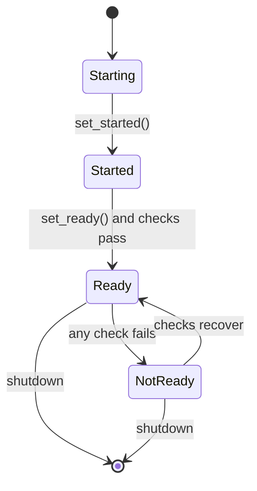

# Health

Kubernetes-style probe endpoints with three-state semantics. Instantiate
`HealthManager`, register downstream checks, mount the FastAPI router,
and the service exposes `/health/live`, `/health/ready`, and
`/health/startup` -- each returning a 200 JSON body when healthy and a
503 with check details when not. The manager itself is pure Python and
has no external dependencies; the router factory imports FastAPI
lazily so the core module installs without it.

```python
from fastapi import FastAPI
from hyperi_pylib.health import HealthManager, create_health_router

health = HealthManager()
app = FastAPI()
app.include_router(create_health_router(health))

# Wire downstream checks.
health.register_ready_check("postgres", lambda: db.is_connected())
health.register_ready_check("kafka", lambda: producer.health_check())

# Flip the gates once init completes.
health.set_started()
health.set_ready()
```

---

## Three probes, three semantics

| Probe | Path | 200 when | 503 when | Purpose |
|-------|------|----------|----------|---------|
| Liveness | `/health/live` | All registered liveness checks pass (or none registered) | A check returns false or raises | K8s restarts the pod |
| Readiness | `/health/ready` | `set_ready()` called AND all readiness checks pass | Either gate fails | K8s removes pod from Service |
| Startup | `/health/startup` | `set_started()` called | Not yet called | K8s defers liveness checks |

Liveness defaults to "alive" when no checks are registered -- the
process is running, that's enough. Readiness defaults to NOT ready
until you explicitly call `set_ready()`. This matters for K8s
rolling updates: the pod stays out of the load balancer until your
init code finishes connecting to downstreams.

---

## Response shape

```json
{
  "status": "ready",
  "timestamp": "2026-05-25T10:30:00.123456+00:00",
  "checks": {
    "postgres": true,
    "kafka": true
  }
}
```

Failed probes return the same shape with `"status": "not_ready"`
(or `"not_alive"`, `"starting"`) and the failing check set to `false`.
Timestamps are RFC 3339 with UTC offset. Checks that raise are
treated as `false` -- the manager catches every exception so one
broken check never takes the probe with it.

---

## K8s probe spec

The probe path defaults in `deployment.contract.HealthContract` are
historical (`/healthz`, `/readyz`). The pylib router emits
`/health/{live,ready,startup}`. Match your manifest to the router:

```yaml
livenessProbe:
  httpGet:
    path: /health/live
    port: http
  initialDelaySeconds: 30
  periodSeconds: 10
  timeoutSeconds: 3
  failureThreshold: 3

readinessProbe:
  httpGet:
    path: /health/ready
    port: http
  initialDelaySeconds: 5
  periodSeconds: 5
  timeoutSeconds: 3
  failureThreshold: 2

startupProbe:
  httpGet:
    path: /health/startup
    port: http
  periodSeconds: 5
  failureThreshold: 30      # 30 * 5s = 150s max startup
```

When using the deployment generator, override
`HealthContract(liveness_path="/health/live",
readiness_path="/health/ready")` so the generated chart matches.

---

## Registering checks

```python
def db_ok() -> bool:
    try:
        db.execute("SELECT 1")
        return True
    except Exception:
        return False

health.register_ready_check("postgres", db_ok)
health.register_live_check("eventloop", lambda: not loop.is_closed())
```

Checks must be synchronous and return a bool. For checks that need
async work, wrap with `asyncio.run` in a thread, or use the parallel
helper:

```python
from hyperi_pylib.concurrency import gather_with_timeouts

async def aggregate_health() -> dict[str, bool]:
    results = await gather_with_timeouts(
        {
            "db": lambda: db.ping(),
            "kafka": lambda: producer.health_check(),
            "redis": lambda: redis.ping(),
        },
        per_task_timeout=1.0,
    )
    return {k: not isinstance(v, Exception) and v for k, v in results.items()}
```

Each check gets its own timeout -- one slow downstream doesn't fail
the others.

---

## Startup phase

Two-stage startup -- mark `set_started()` after init logic completes,
then `set_ready()` after downstreams connect:

```python
async def startup() -> None:
    await db.connect()
    await kafka.connect()
    await cache.warmup()
    health.set_started()        # startup probe passes
    health.set_ready()           # readiness probe passes
```

The startup probe matters for slow-init services -- K8s waits for it
to pass before running liveness checks, preventing a slow boot from
triggering restart loops. Without it, the `initialDelaySeconds`
guess is your only buffer.

---

## State machine



Liveness is independent of this -- the manager tracks it as a
separate set of checks that K8s polls regardless of readiness state.

---

## Without FastAPI

The manager is pure Python; if you use Starlette, Flask, or a custom
framework, wire the responses directly:

```python
health = HealthManager()

# Your framework's handler:
def liveness_handler():
    resp = health.liveness_response()
    status = 200 if health.is_live() else 503
    return JSONResponse(resp, status_code=status)
```

`liveness_response()`, `readiness_response()`, `startup_response()`,
`is_live()`, `is_ready()`, `is_started()` are the full surface.

---

## Related

- [CONFIG.md](CONFIG.md) -- readiness can gate on config validity
- [LOGGING.md](LOGGING.md) -- failed checks log via the same logger
- [METRICS.md](METRICS.md) -- probes are not exported as metrics by design
- [SHUTDOWN.md](SHUTDOWN.md) -- flip ready off before draining
- [api/CONCURRENCY.md](../api/CONCURRENCY.md) -- `gather_with_timeouts` for async checks
- [deployment/CONTRACT.md](../deployment/CONTRACT.md) -- `HealthContract` defaults
- [transport/KAFKA.md](../transport/KAFKA.md) -- consumer-lag readiness check
