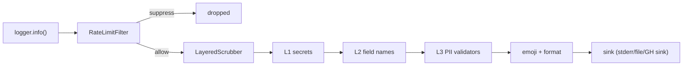

# Logger

Loguru-backed structured logging with RFC 3339 timestamps, layered
secret scrubbing, rate-limiting, and CI-aware output formatting.
Import the logger, log, and the message goes through the scrub
pipeline, the rate-limit filter, and finally a sink chosen by the
detected runtime (TTY, container, or CI). No `logging.basicConfig`,
no `dictConfig`, no per-service boilerplate.

```python
from hyperi_pylib.logger import logger, info, error

info("service started", version="2.28.3")
logger.bind(component="kafka_consumer").info("subscribed", topic="events")

try:
    process()
except Exception:
    error("processing failed", retries=3)
```

---

## Format selection

Format is driven by the explicit `LOG_FORMAT` env var, with a TTY
fallback when unset:

| `LOG_FORMAT` | Effect |
|--------------|--------|
| `json` | JSON-per-line for log aggregators |
| `console` | Colourised, human-readable |
| `text` | Plain text, no colours |
| `logfmt` | `key=value` pairs |
| unset | Auto-detect: console on TTY, text otherwise |

CI environments override autodetect to ASCII-only text format. Set
`HYPERI_LIB_NO_LOGGER_CONFIG=1` to disable auto-configuration if you
need to wire Loguru yourself.

---

## Environment knobs

```bash
LOG_LEVEL=DEBUG              # DEBUG, INFO, WARNING, ERROR, CRITICAL
LOG_FORMAT=json              # json, text, console, logfmt
LOG_OUTPUT=stdout            # stdout, stderr, file
LOG_COLOR=false              # Disable colours (also NO_COLOR=1)
LOG_TIMESTAMP_FORMAT=rfc3339 # iso8601, rfc3339, unix, epoch
LOG_CALLER=true              # Source file:line
LOG_STACKTRACE_LEVEL=ERROR   # Minimum level for tracebacks
HYPERI_LOG_ENQUEUE=0         # Sync sinks (default: fire-and-forget)
```

The same keys live under `logging:` in `settings.yaml` and follow the
[CONFIG cascade](CONFIG.md#the-cascade).

---

## CI autodetect

`setup()` switches to ASCII-only output and disables colours when any
of these are set: `CI=true`, `GITHUB_ACTIONS=true`, `GITLAB_CI=true`,
`JENKINS_URL`, `CIRCLECI=true`, `TRAVIS=true`. GitHub Actions gets a
custom sink that emits workflow commands -- `::error::`, `::warning::`,
`::debug::` -- so log messages annotate the run UI.

CI mode also implies `use_emojis=False`. Override via `setup(ci_mode=False)`
if you really need colours in CI.

---

## Emoji-to-text

CHARS-POLICY-approved emojis (✅ ❌ ⚠️ 💥) are added to console output
when the terminal supports UTF-8. For file sinks, CI mode, and
machine-readable formats, emojis are converted to ASCII tokens:

| Emoji | ASCII |
|-------|-------|
| 💥 | `[FATAL]` |
| ❌ | `[ERROR]` |
| ⚠️ | `[WARN]` |
| ✅ | `[SUCCESS]` |
| 🟢 | `[PASS]` |
| 🔴 | `[FAIL]` |
| 🔁 | `[RETRY]` |

The conversion table lives in `logger.EMOJI_TO_TEXT`; use
`emojis_to_text()` or `strip_emojis()` directly when needed.

---

## Scrub architecture

Three layers fire in order on every log message. Built from
`logger.scrub` package, configured via `ScrubConfig`, composed by
`build_scrubber()`:

| Layer | Source | Detects |
|-------|--------|---------|
| L1 secrets | `scrub/secrets.py` + `gitleaks.toml` rules | AWS keys, GitHub tokens, JWTs, private keys, third-party API keys |
| L2 fields | `scrub/field_names.py` (regex on key names) | `password=...`, `"token":"..."`, bearer tokens, DB URLs |
| L3 PII | `scrub/pii/` validators (Luhn, mod-97, libphonenumber) | Credit cards, IBANs, emails, phones, AU ABN, AU TFN |

There is no L4 -- NLP/NER scrubbing was dropped from scope (the
false-positive rate on logs was unacceptable, and per-call cost of
5-200ms broke structured-log budgets). The L1 rule set is the
gitleaks TOML vendored from hyperi-ai, parsed by
`scrub/gitleaks_toml.py`. The composed scrubber is selected by
`scrub_resolver.py`, which honours (in order): explicit `scrubber=`
arg, explicit `scrub_config=` arg, legacy `mask_sensitive`/
`masking_level` args, new `logging.scrub.*` config keys, legacy
`logging.mask_sensitive_data` config keys, then defaults.

```python
from hyperi_pylib.logger import setup
from hyperi_pylib.logger.scrub import ScrubConfig, build_scrubber

scrubber = build_scrubber(ScrubConfig(
    hash_redaction=True,    # ***REDACTED:a3f2*** lets you correlate without leaking
))
setup(scrubber=scrubber)
```

The legacy `SensitiveDataFilter` in `logger.filters` ships the L2
field set as a backwards-compatible shim. Add custom fields with
`SensitiveDataFilter.add_sensitive_fields({"employee_id", "ssn"})`.

---

## Rate limiting

`RateLimitFilter` suppresses identical messages from tight loops and
reports the suppressed count when logging resumes:

```python
from hyperi_pylib.logger import setup

setup(rate_limit_sec=30, rate_limit_similar=True)

for order_id in range(1000):
    logger.error(f"Failed to process order {order_id}")
# First message fires; the next 999 are suppressed.
# When the period elapses, the next message includes
# "(suppressed 999 similar)".
```

`rate_limit_similar=True` normalises UUIDs, ISO timestamps, IP
addresses, hex strings, and large numbers before matching, so
messages differing only in IDs collapse to one.

---

## Async safety

Sinks default to fire-and-forget (`enqueue=True` on Loguru) -- log
calls return in microseconds even with slow disk or network sinks.
Set `HYPERI_LOG_ENQUEUE=0` for synchronous behaviour, which audit
logs and pytest fixtures asserting on captured output need.

---

## Lifecycle



---

## Related

- [CONFIG.md](CONFIG.md) -- shares the sensitive-field list and cascade
- [METRICS.md](METRICS.md) -- scrub metrics surface as `log_scrub_*`
- [HEALTH.md](HEALTH.md) -- probes log via the same logger
- [SHUTDOWN.md](SHUTDOWN.md) -- log flush on SIGTERM
- [api/CLI.md](../api/CLI.md) -- CLI integrates the CI autodetect
- [EXTRAS-FLAGS.md](../EXTRAS-FLAGS.md) -- scrub deps ship in base; no extras needed
