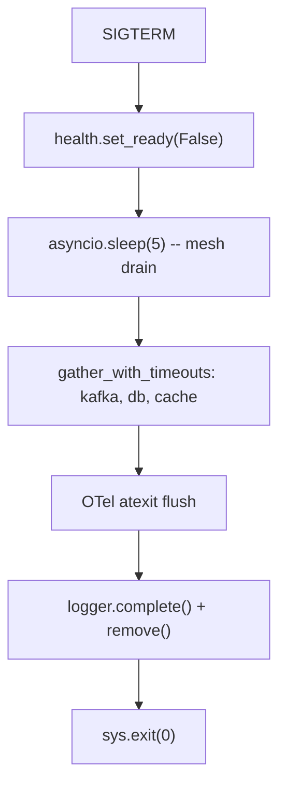

# Shutdown

Pylib does not install signal handlers on import -- shutdown ordering
is the app's job. What pylib ships is the primitive set every shutdown
path needs: `gather_with_timeouts` for parallel drain with per-task
budgets, an `atexit` hook in the OTel backend that flushes pending
metrics before the SDK's own hook, and the readiness flag on
`HealthManager` so K8s removes the pod from the load balancer before
the drain starts. Wire these into your SIGTERM handler and the pod
exits cleanly within the K8s `terminationGracePeriodSeconds` budget.

```python
import signal
import asyncio
from hyperi_pylib.concurrency import gather_with_timeouts

shutdown_event = asyncio.Event()

def handle_sigterm(*_):
    shutdown_event.set()

signal.signal(signal.SIGTERM, handle_sigterm)
signal.signal(signal.SIGINT, handle_sigterm)

async def main():
    # ... start service ...
    await shutdown_event.wait()
    await drain()

async def drain():
    health.set_ready(False)           # K8s stops routing
    await asyncio.sleep(5)             # in-flight requests finish
    await gather_with_timeouts(
        {
            "kafka": lambda: producer.flush(timeout=10),
            "db": lambda: db.close(),
            "cache": lambda: cache.close(),
        },
        per_task_timeout=10.0,
    )
```

---

## The K8s shutdown sequence

K8s shutdown is a six-step dance the app cannot skip. The pod gets
`terminationGracePeriodSeconds` (default 30s) from SIGTERM to exit;
miss it and K8s SIGKILLs the process.

| # | Actor | Action | Pylib piece |
|---|-------|--------|-------------|
| 1 | K8s | Sends SIGTERM to PID 1 | -- |
| 2 | K8s | Removes pod from Endpoints (eventual; ~5s) | -- |
| 3 | App | Flips `/health/ready` to 503 | `health.set_ready(False)` |
| 4 | App | Waits for in-flight requests to drain | `asyncio.sleep(preStop_delay)` |
| 5 | App | Closes downstreams in parallel | `gather_with_timeouts(...)` |
| 6 | App | Process exits | `sys.exit(0)` |

The Endpoints removal is asynchronous; ingress controllers and
kube-proxy have their own caches. Step 3 (flip readiness) tells the
service mesh and load balancer immediately, well before step 2 has
propagated.

---

## preStop hook

K8s `preStop` runs synchronously before SIGTERM. Use it to give the
service mesh time to remove the pod before the app starts draining:

```yaml
spec:
  containers:
    - name: my-service
      lifecycle:
        preStop:
          exec:
            command: ["sleep", "5"]
      terminationGracePeriodSeconds: 30
```

5 seconds is the rough rule for kube-proxy iptables refresh +
service-mesh sidecar drain. The app doesn't see SIGTERM until the
sleep finishes, so in-flight requests have time to land.

If you can't add `preStop`, wire the same delay into the drain:

```python
async def drain():
    health.set_ready(False)
    await asyncio.sleep(5)        # equivalent to preStop sleep
    # ... close downstreams ...
```

---

## Parallel drain with budgets

`gather_with_timeouts` runs every drain task concurrently with its
own timeout. One slow downstream doesn't extend the total drain;
exceptions are captured per-task and returned alongside results.

```python
from hyperi_pylib.concurrency import gather_with_timeouts

results = await gather_with_timeouts(
    {
        "kafka_flush": lambda: producer.flush(timeout=10),
        "db_close": lambda: db.close(),
        "cache_close": lambda: cache.close(),
        "secrets_flush": lambda: secrets.flush(),
    },
    per_task_timeout=10.0,
)
for name, result in results.items():
    if isinstance(result, Exception):
        logger.warning("drain task failed", task=name, error=str(result))
```

Pass factories (`lambda: producer.flush(...)`) not coroutines --
factories let the helper cancel cleanly on timeout.

---

## Kafka producer flush

Producer buffers can hold thousands of records at SIGTERM. Flush
synchronously with a timeout matching your drain budget:

```python
async def drain_kafka():
    # Stop accepting new sends first.
    producer.stop_accepting()
    # Flush waits for librdkafka to ack everything in the buffer.
    producer.flush(timeout=10.0)
```

See [transport/KAFKA.md](../transport/KAFKA.md#shutdown) for the
async producer/consumer drain pattern.

---

## OTel flush

The OTel metrics backend registers an `atexit` hook that fires
BEFORE the OTel SDK's own atexit hook (Python runs atexit handlers
LIFO; registering last means running first). The hook calls
`MeterProvider.shutdown()` which flushes pending OTLP exports.

```python
# Already wired by OpenTelemetryBackend.__init__ -- no app code needed.
import atexit

def _graceful_shutdown():
    try:
        meter_provider.shutdown(timeout_millis=5000)
    except Exception:
        pass

atexit.register(_graceful_shutdown)
```

If the OTel collector is unreachable at shutdown, the flush will
fail and the process exits with code 1 even if everything else
worked. Run a collector sidecar (or accept the exit code in CI) --
this is the known atexit-failure pattern.

---

## Log flush

Loguru sinks default to `enqueue=True` (fire-and-forget on a
background thread). At shutdown, `logger.remove()` blocks until the
queue drains:

```python
async def drain():
    # ... other drain steps ...
    logger.complete()         # flush any pending records
    logger.remove()           # stop sinks
```

Set `HYPERI_LOG_ENQUEUE=0` for synchronous sinks if you need
guaranteed ordering with stdout (CI test capture, audit logs).
See [LOGGING.md](LOGGING.md#async-safety).

---

## Lifecycle



`terminationGracePeriodSeconds` must cover (`preStop sleep`) +
(in-flight request budget) + (drain per_task_timeout) + (OTel flush
budget). For a typical service: 5s preStop + 5s readiness fade + 10s
drain + 5s OTel = 25s. Set 30s and leave headroom.

---

## What pylib does NOT do

- Install signal handlers on import. The app owns SIGTERM/SIGINT.
- Auto-flip readiness on shutdown. You must call `set_ready(False)`.
- Auto-flush Kafka producers. The producer lifecycle is app-specific.
- Auto-close database pools. Connection ownership lives in app code.

The only pylib component with a process-wide hook is OTel's atexit
flush -- because the SDK's own hook would otherwise misorder it.

---

## Related

- [HEALTH.md](HEALTH.md) -- flip ready off first
- [METRICS.md](METRICS.md) -- OTel flush ordering
- [LOGGING.md](LOGGING.md) -- log flush at shutdown
- [api/CONCURRENCY.md](../api/CONCURRENCY.md) -- `gather_with_timeouts` reference
- [transport/KAFKA.md](../transport/KAFKA.md) -- producer/consumer drain
- [deployment/CONTRACT.md](../deployment/CONTRACT.md) -- `terminationGracePeriodSeconds`
- [AUTO-WIRING.md](../AUTO-WIRING.md) -- what's automatic vs manual
