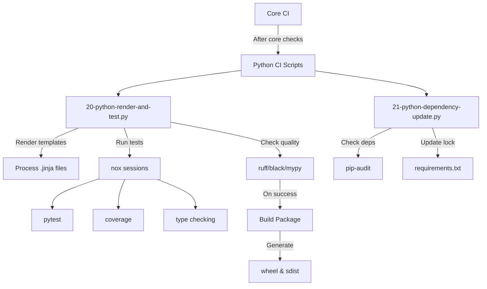
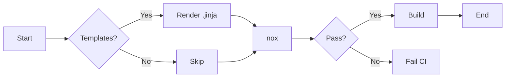
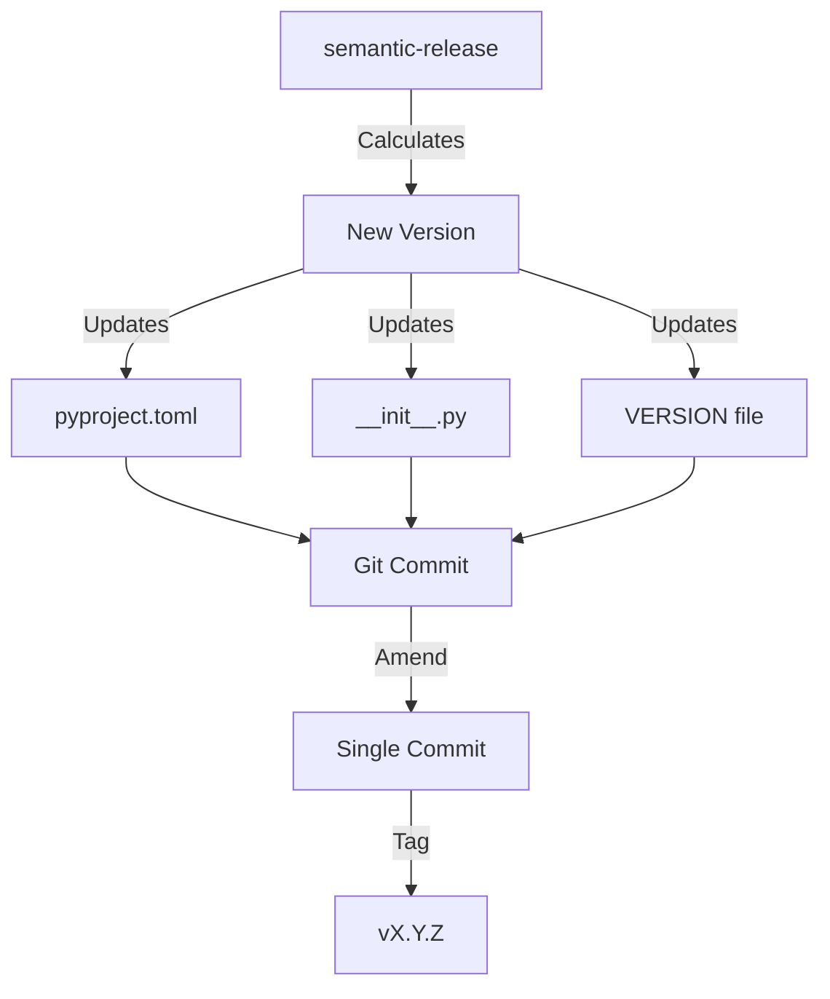
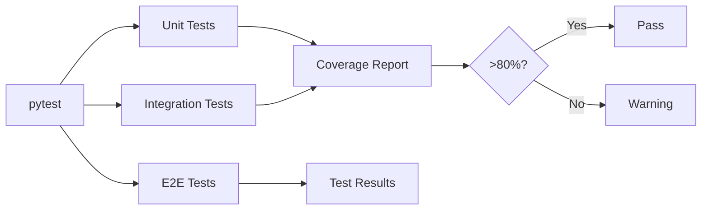
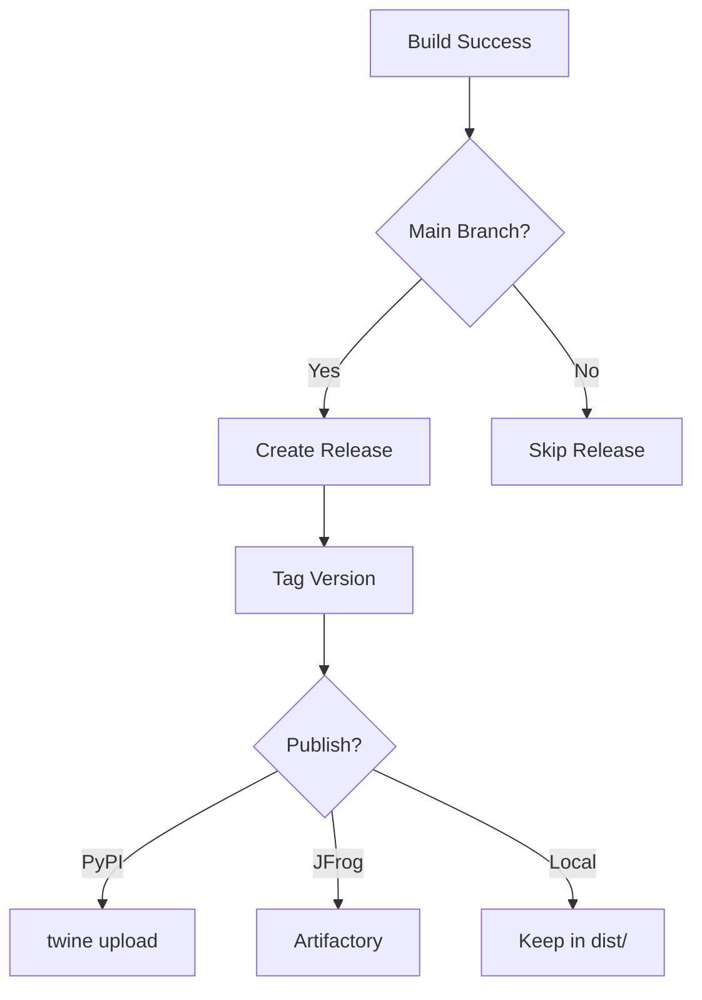
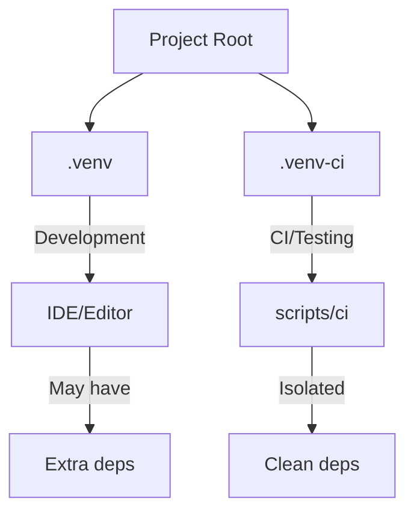

# Python CI/CD Pipeline Documentation

## Overview

The Python-specific CI extends the core CI with Python tooling, testing, and package management.

## Python CI Flow



## Script Details

### 20-python-render-and-test.py

**Purpose**: Main Python CI orchestrator

**Actions**:
1. Render Jinja templates
2. Run nox test sessions
3. Execute linting and formatting
4. Build distribution packages

**Flow**:


### 21-python-dependency-update.py

**Purpose**: Dependency management and security

**Actions**:
1. Audit dependencies for vulnerabilities
2. Check for outdated packages
3. Update lock files
4. Verify Python version compatibility

## Nox Sessions

The Python CI uses nox for task automation:

```python
# noxfile.py structure
@nox.session
def tests(session):
    """Run test suite"""
    session.install(".[dev]")
    session.run("pytest", "tests/")

@nox.session
def lint(session):
    """Run linters"""
    session.install("ruff", "black", "mypy")
    session.run("ruff", "check", "src/")
    session.run("black", "--check", "src/")
    session.run("mypy", "src/")

@nox.session
def build(session):
    """Build packages"""
    session.install("build")
    session.run("python", "-m", "build")
```

## Version Management for Python

### pyproject.toml Configuration

```toml
[tool.semantic_release]
version_variables = [
    "src/package/__init__.py:__version__",
    "pyproject.toml:version",
]
version_toml = [
    "pyproject.toml:project.version",
]
branch = "main"
build_command = "python -m build"
```

### Version Sync Flow



## Python-Specific Checks

### Code Quality Pipeline

| Tool | Purpose | Config | Enforcement |
|------|---------|--------|-------------|
| ruff | Linting | pyproject.toml | Error on violations |
| black | Formatting | pyproject.toml | Error on diff |
| mypy | Type checking | pyproject.toml | Error on type issues |
| pytest | Testing | pyproject.toml | Error on failures |
| coverage | Test coverage | .coveragerc | Warning < 80% |
| bandit | Security | pyproject.toml | Error on high severity |
| safety | Vulnerability | - | Error on CVEs |
| pip-audit | Supply chain | - | Error on issues |
| vermin | Python version | pyproject.toml | Error if < 3.11 |

### Test Execution



## Build & Distribution

### Package Building

```bash
# Triggered by CI after tests pass
python -m build

# Outputs:
# dist/
#   ├── package-X.Y.Z-py3-none-any.whl
#   └── package-X.Y.Z.tar.gz
```

### Distribution Flow



## Environment Setup

### Required Python Tools

Installed by `bootstrap.d/20-python-dev-tools.py`:

```python
tools = {
    "nox": ">=2024.0.0",
    "pytest": ">=8.0.0",
    "ruff": ">=0.1.0",
    "black": ">=24.0.0",
    "mypy": ">=1.8.0",
    "build": ">=1.0.0",
    "twine": ">=5.0.0",
    "pip-audit": ">=2.6.0",
    "safety": ">=3.0.0",
    "bandit": ">=1.7.0",
    "vermin": ">=1.6.0",
}
```

### Virtual Environment Management



## Local Development Workflow

### 1. Initial Setup
```bash
# Create development environment
python -m venv .venv
source .venv/bin/activate
pip install -e ".[dev]"
```

### 2. Pre-commit Checks
```bash
# Run before committing
./scripts/ci
```

### 2b. Template Dry Render & Validation
```bash
# One-shot dry render + basic checks (uses nox session)
nox -s template_check

# Manual render (advanced)
copier copy template /tmp/my-project --force \
  --data project_name=my-project --data package_name=my_project

# Validate rendered project
pip install -e /tmp/my-project
ruff check /tmp/my-project/src
pytest /tmp/my-project/tests
```

### 3. Test Specific Components
```bash
# Run only Python tests
nox -s tests

# Run only linting
nox -s lint

# Run specific pytest
pytest tests/test_specific.py -v
```

### 4. Build Locally
```bash
# Build packages
python -m build

# Check dist/
ls -la dist/
```

## CI Configuration Examples

### Minimal Python Project
```toml
# pyproject.toml
[project]
name = "mypackage"
version = "0.1.0"

[tool.semantic_release]
version_variables = ["src/mypackage/__init__.py:__version__"]
```

### Full Featured Package
```toml
[project]
name = "mypackage"
dynamic = ["version"]

[tool.semantic_release]
version_variables = [
    "src/mypackage/__init__.py:__version__",
]
version_toml = ["pyproject.toml:project.version"]
build_command = "python -m build"
upload_to_pypi = true
```

## Troubleshooting Python CI

### Import Errors
```bash
# Ensure PYTHONPATH
export PYTHONPATH=src:$PYTHONPATH
```

### Nox Session Failures
```bash
# Run with verbose output
nox -v -s tests

# Reuse existing venv
nox -r -s tests
```

### Version Mismatch
```bash
# Check all version locations
grep -r "__version__" src/
grep "version" pyproject.toml
cat VERSION
```

### Build Failures
```bash
# Clean and rebuild
rm -rf build/ dist/ *.egg-info
python -m build --no-isolation
```

## Best Practices

1. **Use nox for consistency**: All Python tasks through nox; prefer `nox -s template_check` to validate template changes
2. **Pin tool versions**: Specify minimum versions in pyproject.toml
3. **Separate envs**: .venv for dev, .venv-ci for CI
4. **Test locally**: Run `nox` before pushing
5. **Document deps**: Explain why each dependency exists
6. **Type hints**: Use throughout for mypy checking
7. **Coverage target**: Maintain >80% test coverage
8. **Security scanning**: Regular pip-audit runs

## Integration with Core CI

The Python CI integrates seamlessly with core CI:

1. **After core checks**: Python scripts run after branch/character validation
2. **Before release**: All tests must pass before semantic-release
3. **Version sync**: Python version fields updated by semantic-release
4. **Build artifacts**: Created after successful tests
5. **Distribution**: Handled by release process

## GitHub Actions for Python

```yaml
name: Python CI/CD
on: [push, pull_request]

jobs:
  test:
    runs-on: ubuntu-latest
    strategy:
      matrix:
        python-version: ["3.11", "3.12"]
    
    steps:
      - uses: actions/checkout@v4
        with:
          fetch-depth: 0
      
      - uses: actions/setup-python@v4
        with:
          python-version: ${{ matrix.python-version }}
      
      - name: Install dependencies
        run: |
          python -m pip install --upgrade pip
          pip install nox
      
      - name: Run nox
        run: nox
      
      - name: Build packages
        run: python -m build
      
      - name: Upload artifacts
        uses: actions/upload-artifact@v3
        with:
          name: dist
          path: dist/
```
